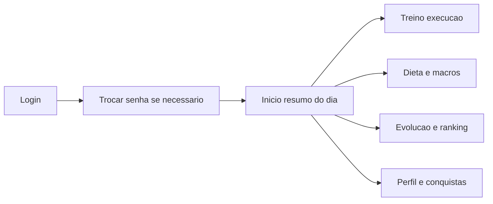

# Guia do app AlimentaAI — usabilidade e funções

Este documento descreve o **AlimentaAI** do ponto de vista de quem usa o aplicativo: objetivos, fluxos principais, telas e benefícios práticos. Não aborda detalhes técnicos de implementação.

---

## Visão geral e proposta de valor

**AlimentaAI** é um aplicativo pensado para o **celular**: interface em tela cheia, navegação por barra inferior e áreas seguras para encaixar em aparelhos com recorte de tela (notch).

Na tela de entrada, o app se apresenta com a ideia central: *“Seu treino e nutrição em um lugar”*.

**Público-alvo:** alunos que seguem **plano de treino** e **orientação nutricional** definidos no contexto da conta (por exemplo, em parceria com profissional ou academia). O conteúdo exibido — treinos do dia, refeições, metas de calorias e macronutrientes — é **personalizado para cada usuário autenticado**.

---

## Primeiro acesso e segurança

1. **Login** com e-mail e senha.
2. Em contas que utilizam senha temporária, o app exige **“Trocar senha inicial”** antes de liberar o restante das funcionalidades. A tela explica o motivo (segurança) e pede **nova senha** e **confirmação**, com validação mínima de tamanho.

Assim, o usuário entende que não é um bloqueio arbitrário, mas uma etapa de proteção da conta.

---

## Navegação principal

O app usa uma **barra fixa na parte inferior** com cinco destinos. O item do meio (**Treino**) aparece **destacado** (botão circular elevado), reforçando que treinar é uma das ações centrais do produto.

| Aba na interface | Função para o usuário |
|------------------|------------------------|
| **Início** | Painel com resumo do dia (treino e refeições). |
| **Dieta** | Nutrição: metas, macros e lista de refeições; é possível mudar o dia. |
| **Treino** | Lista e execução de treinos (filtros: *Todos os treinos*, *Peito*, *Membros superiores*, *Pernas*). |
| **Evolução** | Acompanhamento semanal, visão mensal (em evolução) e aba de metas; ranking. |
| **Perfil** | Identidade (nome, e-mail) e módulo de **Conquistas** (gamificação, ranking e configurações). |

---

## Início — “Resumo rápido do dia”

Ao abrir o **Início**, o usuário vê:

- **Saudação** com um nome amigável (derivado do e-mail quando não há outro nome cadastrado).
- **Treino do dia**
  - Nome do treino planejado para hoje, ou mensagem quando não há treino planejado.
  - Quantidade de exercícios.
  - **Status:** “Pendente” ou “Concluído” (quando o treino de hoje já foi registrado como concluído).
  - Botão **“Abrir treinos”** leva direto à aba Treino.
- **Refeições de hoje**
  - Quantas refeições foram registradas, quantas ainda aparecem como pendentes e total de calorias do dia.
  - Botão **“Abrir dieta”** leva à aba Dieta.

**Objetivo de usabilidade:** em poucos segundos o aluno sabe se o dia está **alinhado** com treino e alimentação, sem precisar abrir várias telas.

---

## Dieta (Nutrição)

Na aba **Dieta**, o usuário acompanha a alimentação **por dia**:

- **Seletor de data** (setas anterior / próximo): é possível **voltar** nos dias para consultar o histórico; **não** é possível avançar além de **hoje** — evita confusão com dados futuros.
- **Resumo do dia** (título “Resumo de hoje” ou “Resumo do dia”):
  - Meta de calorias (kcal), valor consumido, proteína e saldo de kcal.
- **Macros**
  - Barras de progresso para **proteína**, **carboidrato** e **gordura**, com leitura no formato **atual / meta** em gramas.
- **Lista de refeições**
  - Cada linha mostra nome, calorias e um selo **Registrada** ou **Pendente**.
  - Ao **tocar** numa refeição valida, abre-se um **painel de detalhe** com calorias, macros, status, horário e observações (quando existirem); fora do painel ou em “Fechar” volta-se à lista.

**Objetivo de usabilidade:** visão **consolidada** das metas nutricionais e **detalhe sob demanda**, sem poluir a tela principal.

---

## Treino

Na aba **Treino**, o aluno:

- **Filtra** treinos por foco (**Todos os treinos**, **Peito**, **Membros superiores**, **Pernas**), facilitando encontrar o treino certo em agendas com muitas opções.
- Abre um treino e vê a **lista de exercícios** com informações de execução.
- Pode assistir a **vídeos de demonstração** quando o profissional ou o conteúdo disponibilizam link (por exemplo YouTube ou Vimeo embutidos, ou abertura em nova aba conforme o tipo de link).
- Percorre um fluxo de **execução** orientado a séries e **conclusão do treino**. Ao concluir, o app pode mostrar **feedback imediato** de gamificação (como pontos ou conquistas), reforçando o hábito.

Treinos podem vir do **plano orientado pelo profissional** (com data prevista) e, conforme a configuração do serviço, também de **catálogo** oferecido pela academia ou equipe — sempre no mesmo lugar para o usuário.

---

## Evolução

Na aba **Evolução**, o foco é **acompanhar progresso** e **motivação social** opcional:

- Três modos de visão, por **abas:** **Semanal**, **Mensal** e **Metas**.
- Na visão **semanal**, aparecem indicadores como **pontos da semana**, pontos só de **atividade**, **bônus do desafio** e **posição no ranking** (quando o ranking está ativado no perfil).
- Na visão **mensal**, alguns números agregados podem ainda aparecer como indisponíveis (“—”) enquanto o produto evolui — vale tratar essa área como **em evolução** nas expectativas do usuário.
- Na visão **Metas**, o destaque é o **progresso do desafio** (dias ativos, treinos na semana, dias com macros no alvo, se o desafio está completo).
- **Ranking:** lista participantes com pontos da semana; a linha do próprio usuário aparece **destacada** com a indicação “(você)”.
- **Resumo rápido:** textos explicam como pontos e desafio se relacionam com **treinos concluídos** e **registro de refeições** — transparência sobre o que gera pontuação.

---

## Perfil e Conquistas

### Perfil

- Cartão com **avatar** (iniciais), **nome de exibição** (quando configurado) e **e-mail**.
- Abaixo, o mesmo módulo de **Conquistas** usado na gamificação, embutido na tela — evita espalhar configurações em muitos lugares.

### Conquistas (gamificação)

O bloco “Conquistas” (subtítulo contextual **Gamificação** quando em tela própria) organiza o conteúdo em abas:

| Aba | Conteúdo típico |
|-----|------------------|
| **Resumo** | Pontos da semana (atividade, bônus desafio, total); progresso do **desafio da semana** com barras (dias ativos, treinos na semana, dias com macros no alvo). |
| **Conquistas** | Cartões de **badges obtidos** e **bloqueados**, com título, descrição do critério e data de obtenção quando aplicável. |
| **Ranking** | Lista semelhante à da aba Evolução, focada na competição amigável. |
| **Config.** | **Nome para exibição** no ranking e opção de **participar ou não do ranking** — quem prefere privacidade pode desativar a visibilidade na classificação. |

**Exemplos de conquistas previstas na interface:**

- **Primeiro treino** — concluir o primeiro treino no app.
- **4 refeições no dia** — registrar pelo menos quatro refeições no mesmo dia.
- **Campeão da semana** — completar o desafio semanal (atividade, treinos e macros conforme regras do desafio).

Mensagens como **“Configurações salvas!”** ou erro ao salvar dão **feedback claro** após alterar o nome ou o opt-in do ranking.

---

## Fluxo geral (visão em um diagrama)

---

## O que este guia não cobre

- Detalhes de banco de dados, serviços externos ou ambiente de desenvolvimento.
- Para quem for integrar ou implantar o sistema tecnicamente, consulte o **README** do repositório do projeto.

---

*Documento alinhado à experiência atual do app AlimentaAI — uso, funções e usabilidade.*
